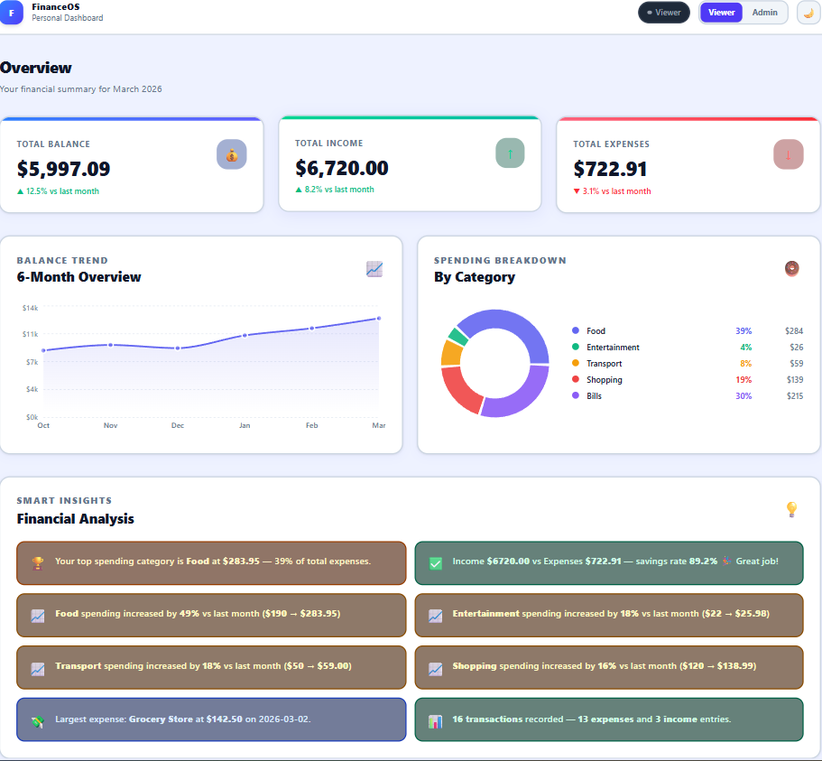
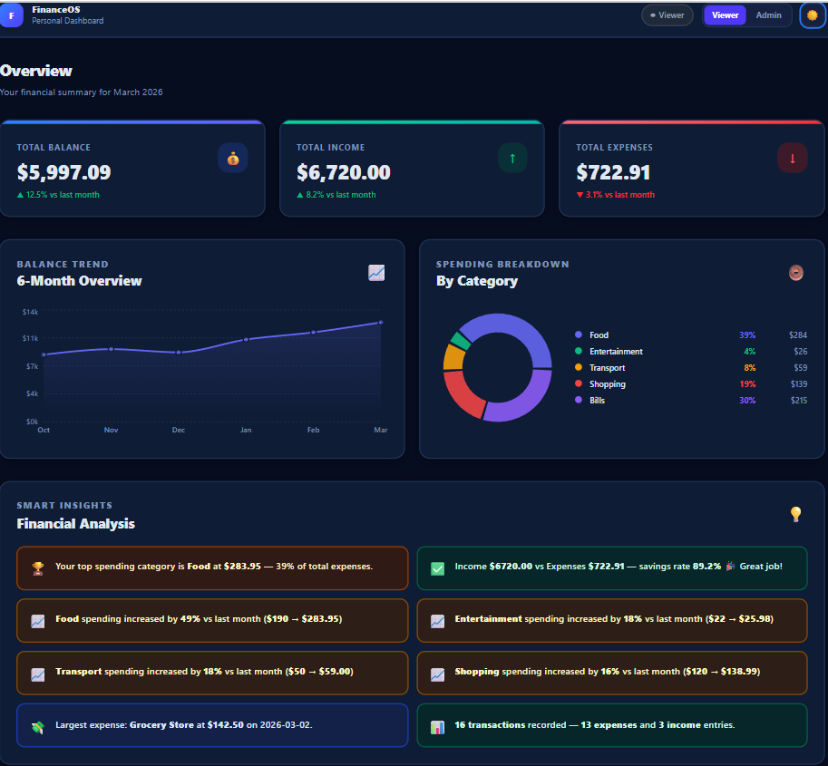
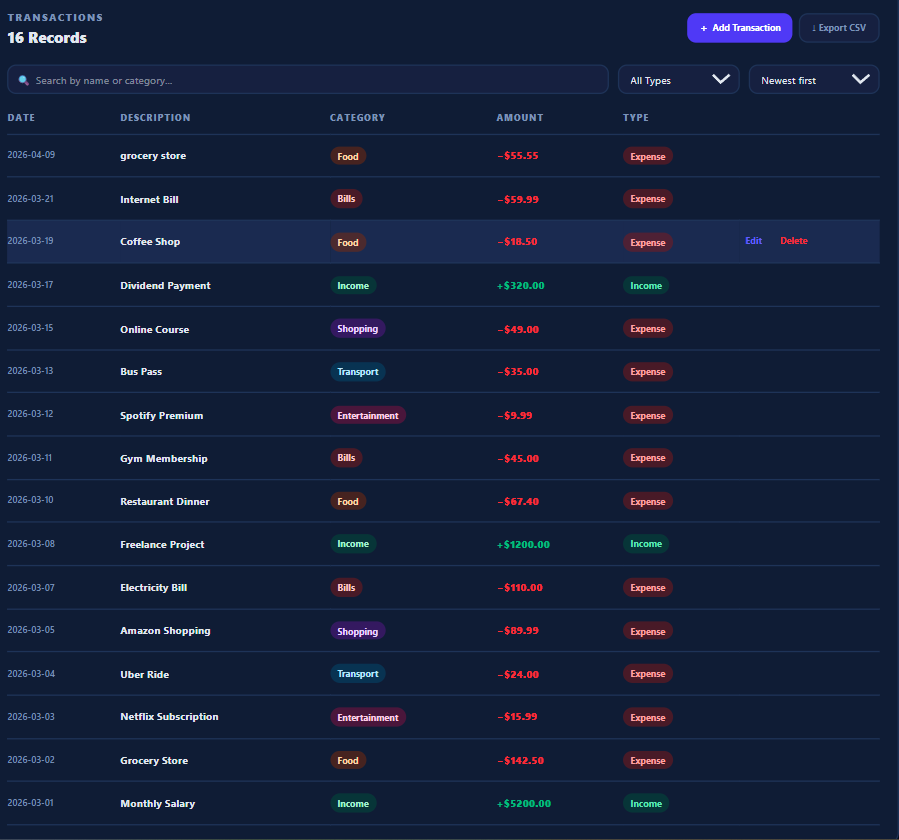

# FinanceOS — Personal Finance Dashboard

## Live Demo

🌐 Live Application  
https://finance-dashboard-ui-pi-virid.vercel.app


A modern, production-quality personal finance dashboard built with **React 19**, **Tailwind CSS v4**, and **Recharts**. Designed to look and feel like a real fintech product (Stripe / Revolut style).


---

## Live Preview

```bash
npm install && npm run dev
```
Open [http://localhost:5173](http://localhost:5173)

---

## Screenshots

### Light Mode


### Dark Mode


### Transactions Table


---

## Features

| Feature | Details |
|---|---|
| Summary Cards | Total Balance, Income, Expenses with trend indicators |
| Balance Trend | 6-month area chart with gradient fill (Recharts AreaChart) |
| Spending Breakdown | Donut chart with custom % + $ legend per category |
| Smart Insights | 5 dynamically calculated financial observations |
| Transactions Table | Search, filter by type, sort by date or amount |
| Role-Based UI | Viewer = read-only · Admin = add / edit / delete / export |
| CSV Export | Downloads currently filtered transactions |
| Dark / Light Mode | Deeply contrasting themes, persisted to localStorage |
| LocalStorage | Transactions and theme survive page refresh |
| Responsive | Mobile, tablet, and desktop layouts |
| Empty States | Distinct UI for "no data" vs "no filter results" |
| Accessibility | Focus rings, aria-labels, semantic HTML, keyboard nav |

---

## Tech Stack

| Tool | Purpose |
|---|---|
| React 19 + Vite | UI framework and build tool |
| Tailwind CSS v4 | Utility-first styling with CSS design tokens |
| Recharts | AreaChart (balance trend) + PieChart (spending) |
| React Context API | Global state — transactions, filters, role, theme |
| useReducer | Predictable transaction state mutations |
| useMemo | Memoized filtered list and totals for performance |
| localStorage | Persist transactions and dark mode preference |

---

## Getting Started

```bash
# 1. Install dependencies
npm install

# 2. Start development server
npm run dev

# 3. Build for production
npm run build
```

---

## Folder Structure

```
src/
├── components/
│   ├── SummaryCard.jsx       # Balance / Income / Expense cards with accent bar
│   ├── BalanceChart.jsx      # 6-month area chart with gradient fill
│   ├── CategoryPieChart.jsx  # Donut chart with custom % legend
│   ├── TransactionTable.jsx  # Table with search, filter, sort, empty states
│   ├── TransactionForm.jsx   # Add / Edit modal (Admin only)
│   ├── InsightsPanel.jsx     # 5 dynamic financial insights (no dangerouslySetInnerHTML)
│   └── RoleSwitcher.jsx      # Pill toggle: Viewer / Admin
├── context/
│   └── FinanceContext.jsx    # Global state with useReducer + useMemo + guards
├── data/
│   └── mockTransactions.js   # 15 sample transactions + chart data + last month spend
├── pages/
│   └── Dashboard.jsx         # Main layout: header, cards, charts, insights, table
├── App.jsx                   # Root — wraps app in FinanceProvider
├── main.jsx                  # Entry point — clears stale localStorage on boot
└── index.css                 # Tailwind + CSS design tokens (--bg-page, --bg-card, etc.)
```

---

## Role System

| Feature | Viewer | Admin |
|---|---|---|
| View transactions | ✅ | ✅ |
| Search & filter | ✅ | ✅ |
| Add transaction | ❌ | ✅ |
| Edit transaction | ❌ | ✅ |
| Delete transaction | ❌ | ✅ |
| Export CSV | ❌ | ✅ |

Switch roles using the **Viewer / Admin** pill toggle in the header.

---

## Smart Insights (Dynamic)

All 5 insights are calculated live from transaction data using `useMemo`:

1. **Top spending category** — name + amount + % of total expenses
2. **Savings rate** — income vs expenses with health label (aim for 20%+)
3. **Month-over-month change** — % increase/decrease per category vs last month
4. **Largest single expense** — description, amount, and date
5. **Transaction count** — total, expenses, and income entries

---

## Design Approach

### Why CSS custom properties instead of only Tailwind dark: variants?
Tailwind v4's `dark:` variants require the class to be present at build time. Using CSS tokens (`--bg-card`, `--text-main`, etc.) gives runtime flexibility and makes the light/dark contrast dramatic and consistent across every component without repeating `dark:` on every element.

### Light mode: `#eef2ff` (blue-tinted white page, pure white cards)
### Dark mode: `#060d1f` (deep navy page, `#0f1c35` cards)
The contrast between page and card is intentional — it creates visual depth that makes the dashboard feel layered, like a real fintech product.

### Why useReducer over useState for transactions?
Transactions have multiple mutation types (ADD, EDIT, DELETE, RESET). `useReducer` keeps all mutation logic in one place, making it easy to audit, test, and extend.

---

## Assumptions Made

- Single-month view (June 2025) — multi-month filtering is a future improvement
- No authentication — role switching is a UI demo, not a security feature
- `lastMonthSpending` in mock data represents May 2025 for MoM comparison
- CSV export downloads the currently filtered/sorted view, not all transactions
- Dark mode defaults to light; preference is saved to localStorage

---

## Edge Cases Handled

| Scenario | Handling |
|---|---|
| No transactions in storage | Falls back to 15 mock transactions |
| Empty array in localStorage | Treated same as missing — loads mock data |
| Filter returns no results | "No transactions found" + Clear filters button |
| All transactions deleted | "No transactions yet" + Add First Transaction CTA |
| `useFinance` outside provider | Throws descriptive error immediately |
| Negative balance | Red trend indicator on Summary Card |
| Savings rate < 0% | 🚨 warning insight shown |

---

## Future Improvements

- [ ] Date range picker for multi-month filtering
- [ ] Budget goals per category with progress bars
- [ ] Recurring transaction detection
- [ ] PDF report export
- [ ] Authentication (login / logout)
- [ ] Bank account connection (Plaid API)
- [ ] Unit tests (Vitest + React Testing Library)
